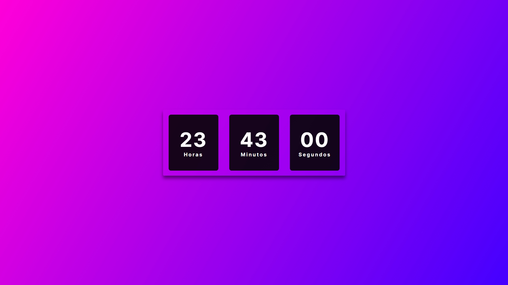

# digital-clock
# [Live preview](https://larissa022.github.io/digital-clock/index.html)

## Sobre

Este projeto é um relógio digital simples implementado usando HTML, CSS e JavaScript. O relógio exibe a hora atual em horas, minutos e segundos, e atualiza a cada segundo. 
